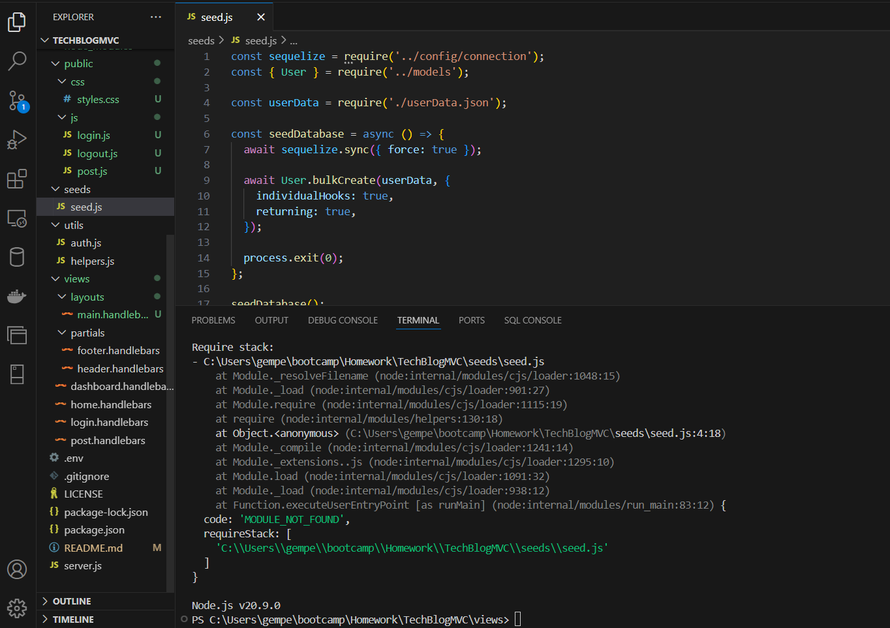

# TechBlogMVC

## Description

TechBlogMVC is a full-stack application designed to provide users with a platform to share and discuss the latest trends and news in technology.

## Table of Contents

- [Installation](#installation)
- [Usage](#usage)
- [License](#license)
- [Contributing](#contributing)
- [Links](#links)
- [Questions](#questions)

## Installation

Open in Heroku

## Usage

- Homepage: View a list of all blog posts.
- Sign Up / Login: Create a new account or log into an existing one.
- Dashboard: Manage your posts, create new posts, edit or delete existing posts.
- Comment: Engage in discussions by commenting on blog posts.

## License

This project is licensed under the MIT license.

## Contributing

Gabby

## Links

Link to repo: https://github.com/gemperador/TechBlogMVC

Link to deployed app: (pending)

## Screenshots

- I encountered this error and attempted to fix it but was unable to run application.

## Questions

For any questions, you can contact me via:

- GitHub: [gemperador](https://github.com/gemperador)

- Email: [email](gabriemperador@gmail.com)
